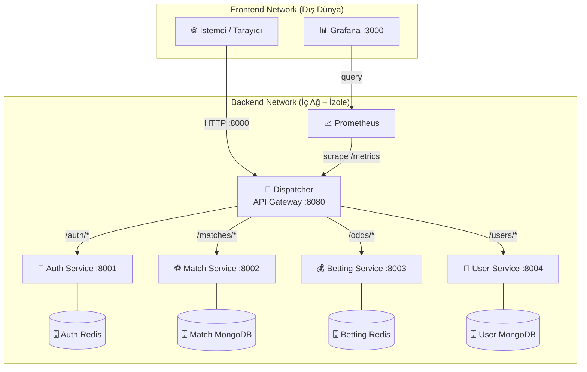

# ⚽ Canlı Skor & Bahis Oranları – Dispatcher Mikroservis Sistemi

> **Kocaeli Üniversitesi – Teknoloji Fakültesi – Bilişim Sistemleri Mühendisliği**
> **Yazılım Geliştirme Laboratuvarı-II – Proje 1**

## 📌 Proje Bilgileri

| Bilgi | Değer |
|-------|-------|
| **Proje Adı** | Canlı Skor & Bahis Oranları Dispatcher Sistemi |
| **Ekip Üyeleri** | Geliştirici 1 – _[İsim]_ · Geliştirici 2 – _[İsim]_ |
| **Tarih** | Mart 2026 |
| **Teknolojiler** | Python, FastAPI, Redis, MongoDB, Docker, Locust, Grafana |

---

## 1. Giriş

Bu proje, mikroservis mimarisi ve servisler arası trafik yönetimini sağlayan bir **Dispatcher (API Gateway)** yazılımının uçtan uca geliştirilmesini amaçlamaktadır. Sistem, yüksek trafikli bir canlı skor ve bahis oranları senaryosunu simüle etmektedir.

### Problem Tanımı

Modern yazılım sistemlerinde, birden fazla bağımsız servisin koordineli çalışması ve dış dünyadan gelen isteklerin güvenli bir şekilde yönetilmesi gerekmektedir. Bu projede:

- Merkezi bir **Dispatcher** aracılığıyla tüm isteklerin yönlendirilmesi
- **TDD (Test-Driven Development)** disipliniyle geliştirme
- **Network Isolation** ile güvenlik sağlanması
- **Richardson Olgunluk Modeli Seviye 2** standartlarına uygunluk

hedeflenmiştir.

---

## 2. Sistem Mimarisi



---

## 3. Servis Detayları

_(Bu bölüm geliştirme sürecinde detaylandırılacaktır)_

### 3.1 Dispatcher (API Gateway)
### 3.2 Auth Service
### 3.3 Match Service (Canlı Skor)
### 3.4 Betting Service (Canlı Oran)
### 3.5 User Service (Favori Takip)

---

## 4. Richardson Olgunluk Modeli (RMM) Uyumu

_(Seviye 2 uyumu detaylarıyla açıklanacak)_

---

## 5. TDD Süreci

_(Red-Green-Refactor döngüsü örneklerle gösterilecek)_

---

## 6. Docker & Network Isolation

_(Docker Compose yapısı ve izolasyon kanıtları eklenecek)_

---

## 7. Grafana & İzleme

_(Dashboard ekran görüntüleri eklenecek)_

---

## 8. Yük Testi Sonuçları

_(Locust test senaryoları ve sonuç tabloları eklenecek)_

---

## 9. Sonuç ve Tartışma

_(Başarılar, sınırlılıklar ve olası geliştirmeler eklenecek)_

---

## 🚀 Hızlı Başlangıç

```bash
# Repoyu klonla
git clone <REPO_URL>
cd yazlab.II-I

# Ortam değişkenlerini ayarla
cp .env.example .env

# Tüm sistemi ayağa kaldır
docker-compose up --build

# Dispatcher: http://localhost:8080
# Grafana:    http://localhost:3000 (admin/admin)
```
