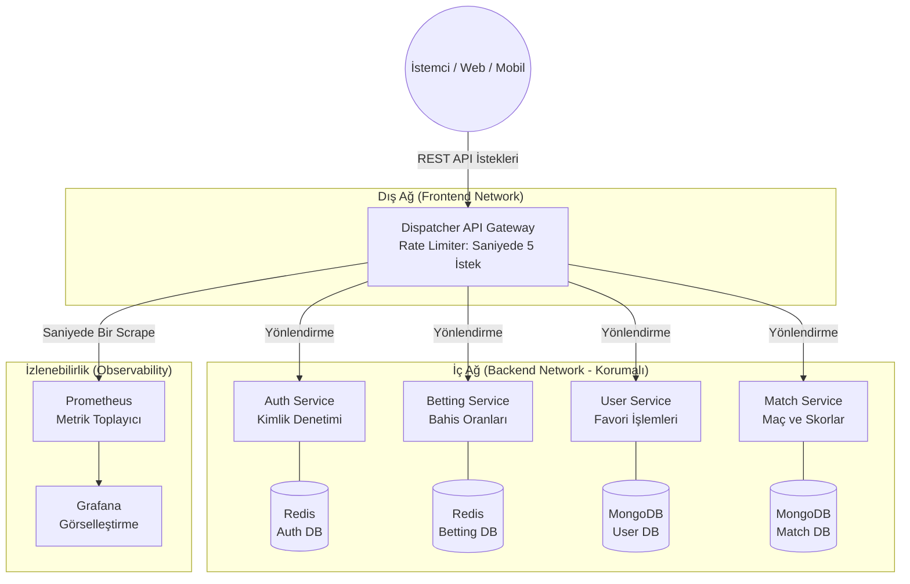
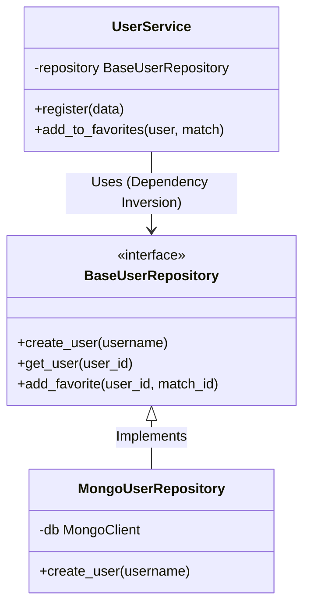

# 🏆 Yazılım Geliştirme Laboratuvarı II-I: Olay Odaklı Mikroservis Mimarisi ve İzlenebilirlik

- **Ders:** Yazılım Laboratuvarı II (Ödev-1)
- **Geliştirici Ekibi:** Duha Yusuf Bindere (231307077) & Ahmet ÖZ (231307094)
- **Tarih:** 04 Nisan 2026

---

## 🎯 1. Projenin Amacı ve Problem Tanımı
Günümüz modern yazılım dünyasında, tek bir uygulamanın yetersiz kaldığı devasa sistemlerde **Mikroservis Mimarisi** hayati önem taşımaktadır. Bu projenin amacı, monolitik (tek parça) bir yapı yerine sorumlulukların parçalandığı, yatay olarak ölçeklenebilen, yüksek yük (yüzlerce RPS) altında test edilmiş ve TDD (Test Driven Development) test süreçleriyle güvence altına alınmış asıl üretime (production) çıkmaya hazır bir altyapı inşa etmektir.  

Projemizde konu senaryosu olarak **"Canlı Skor ve Bahis Oranları Sistemi"** işlenmiştir. Servisler arası iletişim ve bağımsız veritabanı (Database-per-service) prensibiyle, her servis sadece kendi uzmanlık alanına giren işi yapmaktadır.

---

## 🏗️ 2. Sistem Mimarisi (Architecture)

Projede tüm dış dünya (kullanıcı/istemci) istekleri doğrudan iç servislere erişemez. Ağ izolasyonu sağlanmış olup istekler öncelikle **Dispatcher (API Gateway)** üzerinden yönlendirilir.



---

## 🧩 3. Sınıf ve Nesneye Yönelimli Tasarım (UML - SOLID Uyumu)

Tüm servisler **SRP (Single Responsibility Principle)** ve **DIP (Dependency Inversion Principle)** ilkelerine sıkı sıkıya bağlı kalarak tasarlanmıştır. `Abstract` interfaceler sayesinde veri tabanı ile iş mantıkları (Business Logic) ayrıştırılmıştır.



### Örnek Akış (Sequence Diagram): Yeni Hesap Açma ve Favori Ekleme

```mermaid
sequenceDiagram
    actor Client as İstemci (Client)
    participant Dispatcher as Dispatcher (API Gateway)
    participant Auth as Auth Service (Redis)
    participant Match as Match Service (MongoDB)
    participant Betting as Betting Service (Redis)
    
    %% Authentication Flow
    rect rgb(40, 44, 52)
    Note right of Client: 1. Kullanıcı Girişi (Public Route)
    Client->>Dispatcher: POST /auth/login (username, password)
    Note over Dispatcher: Public Route: Auth Middleware'i Pas Geçer
    Dispatcher->>Auth: İsteği Doğrudan İletir (Proxy)
    Auth->>Auth: Kullanıcıyı doğrula ve Token üret
    Auth-->>Dispatcher: 200 OK + JWT Token
    Dispatcher-->>Client: 200 OK + JWT Token
    end
    
    %% Match Update & Betting Odds Trigger Flow
    rect rgb(40, 44, 52)
    Note right of Client: 2. Skor Güncelleme & Servisler Arası İletişim
    Client->>Dispatcher: PUT /matches/{id} (Yeni Skor) + Bearer Token
    
    %% Auth Middleware Verification
    Note over Dispatcher: AuthMiddleware Devreye Girer
    Dispatcher->>Auth: POST /auth/verify (Token)
    Auth-->>Dispatcher: 200 OK (Token Geçerli, Rol: Admin/Kullanıcı vb.)
    
    %% Request Forwarding
    Note over Dispatcher: Token doğrulandı, istek asıl servise iletiliyor
    Dispatcher->>Match: Yönlendirme: PUT /matches/{id}
    
    %% Match Update Business Logic
    Match->>Match: MongoDB'de mevcut maçı bul ve Skoru Güncelle
    
    %% Cross-service Event
    Note over Match, Betting: Skor değişimi tespit edildi, Event tetikleniyor!
    Match->>Betting: POST /odds/score-update (match_id, yeni skor, statü)
    Betting->>Betting: OddsCalculator ile yeni oranları hesapla
    Betting->>Betting: Redis'te yeni oranları kaydet
    Betting-->>Match: 200 OK (Oranlar güncellendi)
    
    %% Final Response
    Match-->>Dispatcher: 200 OK (Güncellenmiş Maç Objesi)
    Dispatcher-->>Client: 200 OK (Güncellenmiş Maç Objesi)
    end
```


---

## 🌐 4. RESTful Servisler ve RMM Seviye 2 Uyumu

Projemizde "Richardson Olgunluk Modeli" (RMM) Seviye 2 standartları eksiksiz bir şekilde sağlanmıştır. Her işlem HTTP metotlarına uygun (GET okumak için, POST yaratmak için, PUT güncellemek için) yapılandırılmıştır.

| Endpoint | HTTP Metodu | Sorumlu Servis | Açıklama | Beklenen HTTP Statüsü |
|----------|------------|----------------|-----------|------------------------|
| `/auth/register` | `POST` | Auth | Yeni kullanıcı kaydı açar. | `201 Created` |
| `/auth/login` | `POST` | Auth | Kullanıcı girişi ve JWT Token üretimi. | `200 OK` veya `401 Unauthorized` |
| `/matches/` | `GET` | Match | Sistemdeki tüm canlı/geçmiş maçları getirir. | `200 OK` |
| `/matches/{id}` | `PUT` | Match | Maç skorunu günceller. | `200 OK` veya `404 Not Found` |
| `/odds/` | `POST` | Betting | Belirli bir maça yönelik bahis oranlarını açar. | `201 Created` |
| `/users/{id}/favorites`| `DELETE`| User | Kullanıcının listesinden belirtilen maçı çıkartır.| `204 No Content` |


---

## 🧪 5. Test Güvencesi (TDD ve E2E)

Projenin tamamı **Red-Green-Refactor** döngüsüne sadık kalınarak TDD kuralları ile kodlanmıştır. Önce senaryoyu batıracak (Red) testler yazılmış, ardından bu testleri geçecek (Green) yapısal kodlar dahil edilmiştir.
Sistemde an itibariyle **104/104 başarılı Birim Testi (Unit Test)** koşulmaktadır. Bunun haricinde, Uçtan Uca (E2E) Entegrasyon testleri modülüyle tüm servislerin network üzerinden birbiriyle anlaşıp anlaşamadığı da güvence altındadır.


> 


---

## 🐳 6. Docker & Ağ İzolasyonu (Network Isolation)

Projeyi kurmak veya manuel bağımlılık yüklemek gerekmez. Sistem tamamen sarmalanmış konteynerlerden oluşur. 
`docker-compose.yml` aracılığıyla toplam 11 konteyner kurulur. Veritabanları sadece ilgili servisin ulaşabileceği izole ağlarda gizlenmiştir, dışarıya port (örneğin 27017) açılmaz. Dışarıya açık tek kanal Dispatcher (`8080`) porta ayarlanmıştır.

**Sistemi Tek Komutla Çalıştırma:**
```bash
docker-compose up -d --build
```
> 


---

## 📉 7. Grafana İzlenebilirlik Mimarisi (Observability)

Sistemin kalbini izlemek için Prometheus altyapısıyla **Mimarî Gözlem Paneli** tasarlanmıştır. Ekran sıfırdan "Infrastructure as Code" (JSON dosyası) kullanılarak konfigüre edilmiştir.

**Panelde Yer Alan Metrikler:**
1. **İstek Sayısı (RPS):** Sisteme gelen anlık trafik yükü.
2. **Ortalama Gecikme (Latency):** Yanıt süreleri (Genellikle 100-140ms bandında seyretmektedir).
3. **HTTP Durum Kodu Dağılımı:** (Pasta Grafik) Rate Limiter savunmasının başarısı (% oranında `429 Too Many Requests`) ve başarılı `200` dönüşleri.
4. **Genel Hata Oranı:** Sunucu kaynaklı (`5xx`) çöküş hataları takibi.


> 


---

## 🚀 8. Locust Yük Testi Performansı

Sistemin yük altındaki tepkisini ölçmek adına Python `locust` kütüphanesi kullanılmıştır. 5 farklı kullanıcı psikolojisi (Canlı skorcu, Favori ekleyen, Bahisçi, Hacker/Yetkisiz Sızmacı) simüle edilmiştir.

**Test Özeti (500 Eşzamanlı Kullanıcı):**
- **Saniyede Ortalama İşlenen İstek (RPS):** 354
- **Toplam Gönderilen İstek:** İki dakikada 21,253
- **Ortalama Yanıt Süresi:** 139 milisaniye
- **Sunucu Hata (Çökme) Oranı:** **Sadece %0.10**

Sistem 500 eşzamanlı aktif kullanıcıda bile son derece güvenilir kalmış, Dispatcher üzerinde kodlamış olduğumuz `InMemoryRateLimiter` yapısı siber saldırı gibi anormal yüklenen istekleri bloklayarak kaleyi içten çökertilmekten kurtarmıştır.

---

## 💡 9. Sonuç ve Gelecek Geliştirmeler

Bu projenin sonucunda Monolitik ve Spagetti kod devrinden, birbirinden habersiz şekilde büyüyebilen ama birbiriyle tam güven uyumunda çalışan Mikroservis ağı dizayn edilmiştir.
- **Sınır:** Rate limiter ve MongoDB kayıt bloklamaları devasa (Milyon) isteklerde sunucu kaynaklı gecikmelere sebep olmaya başlar.
- **Geliştirme Önerisi:** Proje bulut (AWS/GCP) altyapısına taşınıp Load Balancer arkasında Kubernetes (K8s) ile yatayda otomatik ölçeklenebilir hale getirilirse sınırsız trafiğe cevap verebilir potansiyeldedir.

*- "Hatasız sistem yoktur, iyi izlenen (monitor edilen) ve hatalara karşı kendi önlemini alabilen ölçeklenmiş sistem vardır."*
